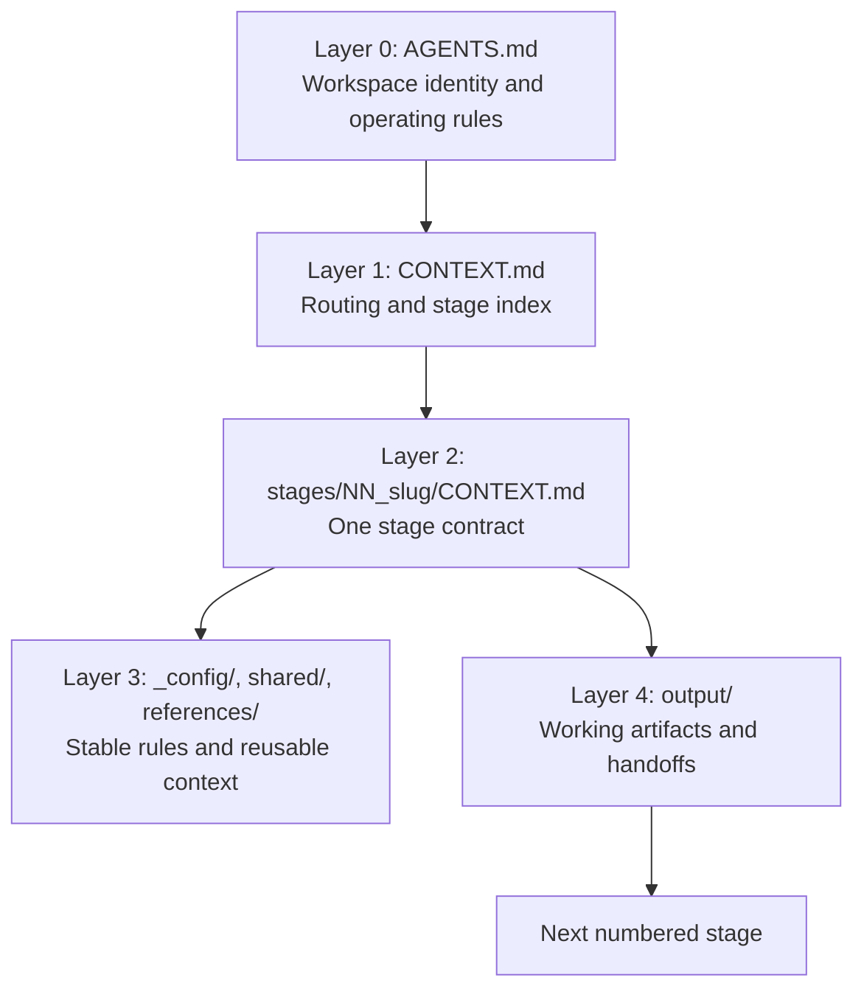

# Interpretable Context Methodology (ICM) Reusable Template

Beginner-friendly starter kit for building filesystem-based AI agent workflows with [Interpretable Context Methodology](https://arxiv.org/html/2603.16021v2).

Think of ICM as Trello meets Makefile meets agent prompts: each numbered folder is a step in the workflow, each `CONTEXT.md` file says what that step does, and each `output/` folder is a human-reviewable handoff.

## Start Here

Install the CLI from the latest GitHub release in a virtual environment:

```bash
python -m venv .venv
source .venv/bin/activate
python -m pip install git+https://github.com/stickwithfiddle-sys/interpretable-context-methodology-template.git@v0.6.0
icm new my-first-icm-workspace --name "My First ICM Workspace"
```

Then open the new folder and fill in:

```text
my-first-icm-workspace/stages/00_intake/output/project-brief.md
```

Ask your coding agent:

```text
Read AGENTS.md and CONTEXT.md, then run stages/00_intake.
Write only the declared outputs, run the Verify checks, and stop at the Review Gate.
```

Finally, validate the workspace structure:

```bash
icm validate my-first-icm-workspace --strict
```

Expected output:

```text
OK: workspace passed validation with 0 warning(s)
```

On Windows PowerShell, use backslashes if you prefer:

```powershell
python -m venv .venv
.\.venv\Scripts\Activate.ps1
python -m pip install git+https://github.com/stickwithfiddle-sys/interpretable-context-methodology-template.git@v0.6.0
icm new my-first-icm-workspace --name "My First ICM Workspace"
icm validate my-first-icm-workspace --strict
```

If you are developing from this repo, install the editable package:

```bash
python -m venv .venv
source .venv/bin/activate
python -m pip install -e ".[dev]"
icm status examples/completed-content-plan
```

To install from GitHub instead of cloning first, see [docs/install.md](docs/install.md).

## Why This Exists

Most agent workflows become hard to inspect once the logic lives inside a chat thread, framework state, or hidden prompt chain. ICM keeps the workflow visible:

- Stages are folders.
- Agent instructions are markdown.
- Inputs and outputs are plain files.
- Humans review artifacts between steps.
- Repeated fixes move upstream into reusable source files.

This is useful for research synthesis, planning, content production, documentation systems, policy workflows, analysis pipelines, and any project where each intermediate artifact should be readable before the next step runs.

## Five-Layer Mental Model



The most important habit: do not ask the agent to load everything. Ask it to follow the current stage contract.

## Learn By Example

Start with these files:

| File | Use |
| --- | --- |
| [docs/first-workspace.md](docs/first-workspace.md) | Step-by-step first run tutorial |
| [docs/glossary.md](docs/glossary.md) | Plain-language definitions of ICM terms |
| [docs/install.md](docs/install.md) | GitHub, virtualenv, and local install options |
| [examples/completed-content-plan](examples/completed-content-plan) | Completed example workspace with filled stage outputs |
| [docs/product-direction.md](docs/product-direction.md) | UX/product roadmap, including Hermes Agent-inspired ideas |
| [docs/revision-audit.md](docs/revision-audit.md) | Current product audit, UX assessment, and next direction options |
| [docs/release-process.md](docs/release-process.md) | Versioning, release, and GitHub workflow checklist |
| [docs/research-summary.md](docs/research-summary.md) | Practical summary of the ICM paper |
| [docs/template-design.md](docs/template-design.md) | Design decisions behind this starter kit |

## CLI MVP

The product path is the `icm` CLI:

```bash
python -m icm new ../demo --name "Demo"
python -m icm validate ../demo --strict
python -m icm status ../demo
python -m icm next ../demo
python -m icm explain stages/01_discovery --workspace ../demo
python -m icm review stages/01_discovery --workspace ../demo
python -m icm doctor ../demo
```

After installing in a virtual environment with `python -m pip install -e .`, the same commands are available as:

```bash
icm new ../demo --name "Demo"
icm validate ../demo --strict
icm status ../demo
icm next ../demo
icm explain stages/01_discovery --workspace ../demo
icm review stages/01_discovery --workspace ../demo
icm doctor ../demo
```

## What Is Included

```text
templates/icm-workspace/
  AGENTS.md                 Layer 0: workspace identity and agent operating rules
  CONTEXT.md                Layer 1: routing and stage index
  _config/                  Layer 3: stable project rules and reusable preferences
  _templates/               Reusable markdown templates for new stages and reviews
  shared/                   Cross-stage notes, decisions, backlog, and glossary
  stages/                   Layer 2 stage contracts and Layer 4 output folders
  .github/prompts/          Optional VS Code prompt files for running/reviewing stages
examples/
  completed-content-plan/   Filled example workspace for a small content workflow
tools/
  new_icm_workspace.py      Copies the template into a new project folder
  validate_icm_workspace.py Checks stage naming, contracts, and handoff folders
icm/
  cli.py                    Product CLI for new, validate, status, next, explain, review, doctor
tests/
  test_cli.py               CLI behavior coverage
  test_workspace.py         Workspace helper and review coverage
docs/
  first-workspace.md        Beginner tutorial
  glossary.md               Plain-language terms
  install.md                Install options and package smoke checks
  product-direction.md      UX and product roadmap
  release-process.md        GitHub and versioning workflow
  research-summary.md       Practical findings extracted from the paper
  template-design.md        Design decisions and adaptation notes
```

## Builder Pipeline

The included template is a workspace-builder. Its output is a project-specific ICM workspace.

| Stage | Purpose | Main Output |
| --- | --- | --- |
| `00_intake` | Capture the project brief and constraints | `project-brief.md` |
| `01_discovery` | Identify domain, users, deliverables, risks, and workflow shape | `discovery-report.md` |
| `02_stage_mapping` | Choose natural breakpoints, review gates, and handoffs | `stage-map.md` |
| `03_scaffold` | Define the project workspace tree and stage contracts | `scaffold-plan.md` |
| `04_questionnaire` | Produce setup questions and reference-material prompts | `setup-questionnaire.md` |
| `05_validation` | Dry-run the workflow and report gaps before use | `validation-report.md` |

## Common Mistakes

| Mistake | Better Move |
| --- | --- |
| Asking the agent to "do the whole project" | Ask it to run one numbered stage and stop at the review gate |
| Treating `output/` files as disposable | Review and edit them; they are the audit trail |
| Putting project rules in a chat message | Put stable rules in `_config/`, `shared/`, or `references/` |
| Adding a stage for every tiny task | Add a stage only when there is a real handoff, context boundary, or review point |
| Fixing the same output issue repeatedly | Update the stage `CONTEXT.md` or reference file so future runs improve |
| Loading the whole repo for every step | Load only the files listed in the current stage's Inputs table |

## When To Use ICM

Use ICM when a workflow is sequential, reviewable, and repeatable: one stage produces a plain-text artifact, a human can inspect or edit it, and the next stage reads that artifact as input.

Use a conventional framework instead when you need real-time multi-agent collaboration, high-concurrency service infrastructure, automated branching based on model decisions, or tight message-passing loops.

## Status

Experimental starter kit. The template is intended to make ICM easy to try, inspect, and adapt; it is not an official release of the original ICM protocol.

Current package version: `0.6.0`.

Release notes live in [CHANGELOG.md](CHANGELOG.md). Contribution and review practices live in [CONTRIBUTING.md](CONTRIBUTING.md) and [docs/release-process.md](docs/release-process.md).

Repository safety practices live in [SECURITY.md](SECURITY.md) and [.github/CODEOWNERS](.github/CODEOWNERS). Public users can open issues, forks, and pull requests, but they cannot directly change protected `main` without maintainer-controlled review and passing checks.

Maintained by Hobo.

## Research Basis

The ICM paper was authored by Jake Van Clief and David McDermott. It argues for five design principles: one stage, one job; plain text as the interface; layered context loading; every output as an edit surface; and configuring the factory rather than each product. This template applies those principles with a model-neutral `AGENTS.md` Layer 0 file, explicit stage contracts, scoped Layer 3 references, Layer 4 output handoffs, and a validator script.

See [docs/research-summary.md](docs/research-summary.md) for the research notes and [docs/template-design.md](docs/template-design.md) for implementation choices.

## Attribution

This project is an independent reusable template based on the paper:

> Jake Van Clief and David McDermott. "Interpretable Context Methodology: Folder Structure as Agent Architecture." arXiv:2603.16021v2, 18 Mar. 2026.

The ICM protocol referenced by the paper is described as open source under the MIT license. This repository is a derived starter template and should not be read as an official repository or endorsement by the paper authors.

## License

MIT. See [LICENSE](LICENSE).
