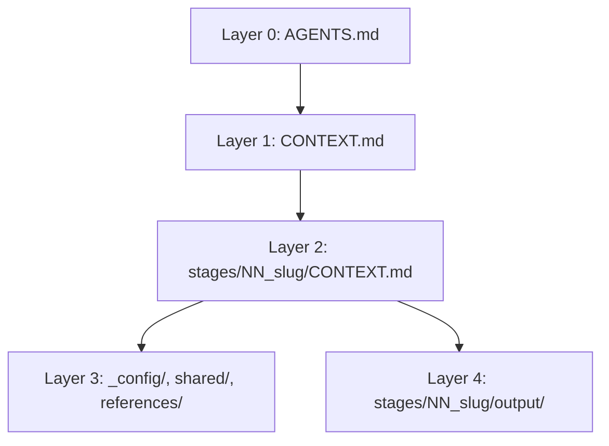

# Documentation Refresh Example

This is a completed Interpretable Context Methodology example workspace created on 2026-05-30.

It shows how the template can design a project-specific documentation refresh workflow with source inventories, gap analysis, review gates, and deterministic rubric checks for table columns and cited paths.

Read the outputs in order:

1. `stages/00_intake/output/project-brief.md`
2. `stages/01_discovery/output/discovery-report.md`
3. `stages/02_stage_mapping/output/stage-map.md`
4. `stages/03_scaffold/output/scaffold-plan.md`
5. `stages/04_questionnaire/output/setup-questionnaire.md`
6. `stages/05_validation/output/validation-report.md`

## Start Here

1. Inspect `stages/01_discovery/output/discovery-report.md`.
2. Compare it to `stages/01_discovery/references/discovery-report-rubric.md`.
3. Run `icm review stages/01_discovery`.
4. Notice the PASS lines for required table columns and link/path references.

Paste this to your agent:

```text
Read AGENTS.md and CONTEXT.md, then run stages/00_intake.
Load only the inputs declared in that stage's CONTEXT.md.
Write only the declared outputs, run Verify, and stop at the Review Gate.
```

## Validate

```bash
icm validate --strict
icm status .
icm review stages/01_discovery
icm doctor --strict
```

Expected output:

```text
OK: workspace passed validation with 0 warning(s)
```

If the `icm` command is not installed, use the bundled validator:

```bash
python tools/validate_icm_workspace.py . --strict
```

## Useful CLI Commands

```bash
icm status .
icm next .
icm explain stages/01_discovery
icm review stages/01_discovery
icm doctor .
```

`stages/01_discovery/references/discovery-report-rubric.md` shows the starter rubric pattern. The discovery report should include a `Source Traceability` section that cites the input files it used.

This example extends that pattern with:

- `Required Table Columns`
- `Required Link Or Path Count`

## Layer Map



| Layer | Location | Purpose |
| --- | --- | --- |
| 0 | `AGENTS.md` | Agent identity and workspace operating rules |
| 1 | `CONTEXT.md` | Stage routing and shared resources |
| 2 | `stages/*/CONTEXT.md` | Stage-specific contracts |
| 3 | `_config/`, `shared/`, `stages/*/references/` | Stable reference material |
| 4 | `stages/*/output/` | Per-run artifacts and handoffs |

## Source-Level Improvement

If you keep editing the same kind of issue in `output/`, move that fix upstream:

- Stage behavior: `stages/NN_slug/CONTEXT.md`
- Stable rules: `_config/*.md`
- Stage examples or rubrics: `stages/NN_slug/references/*.md`
- Cross-stage decisions: `shared/*.md`
