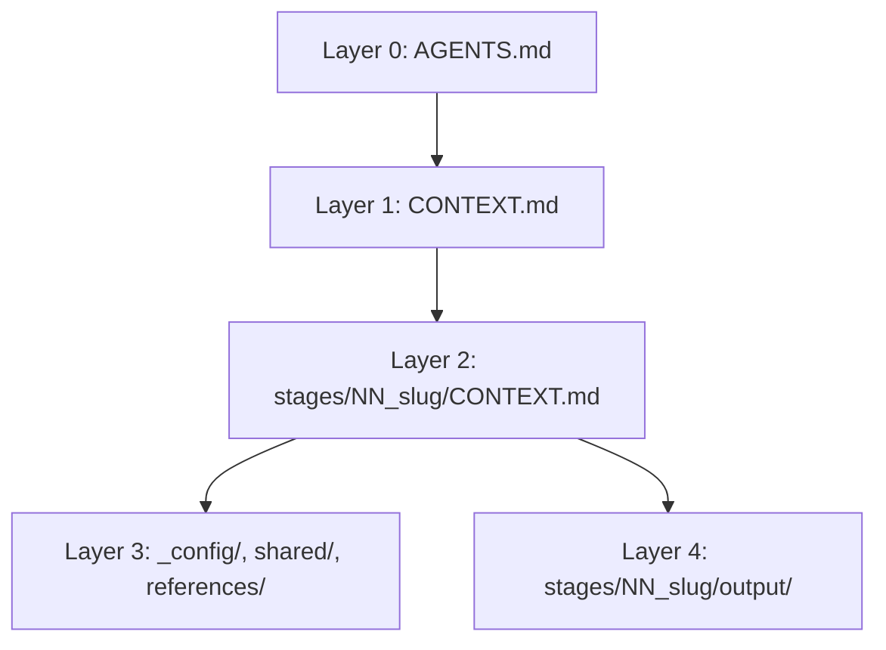

# {{PROJECT_NAME}}

This is an Interpretable Context Methodology workspace created on {{CREATED_DATE}}.

The workspace uses folders, markdown contracts, and local scripts as the agent orchestration layer.

## Start Here

1. Fill in `stages/00_intake/output/project-brief.md`.
2. Ask your agent to run `stages/00_intake`.
3. Review the output before moving to `stages/01_discovery`.
4. Continue one numbered stage at a time.

Paste this to your agent:

```text
Read AGENTS.md and CONTEXT.md, then run stages/00_intake.
Load only the inputs declared in that stage's CONTEXT.md.
Write only the declared outputs, run Verify, and stop at the Review Gate.
```

## Validate

```bash
icm validate --strict
```

Expected output:

```text
OK: workspace passed validation with 0 warning(s)
```

If the `icm` command is not installed, use the bundled validator:

```bash
python tools/validate_icm_workspace.py . --strict
```

## Useful CLI Commands

```bash
icm status .
icm next .
icm explain stages/01_discovery
icm review stages/01_discovery
icm doctor .
```

`stages/01_discovery/references/discovery-report-rubric.md` shows the starter rubric pattern. The discovery report should include a `Source Traceability` section that cites the input files it used.

## Layer Map



| Layer | Location | Purpose |
| --- | --- | --- |
| 0 | `AGENTS.md` | Agent identity and workspace operating rules |
| 1 | `CONTEXT.md` | Stage routing and shared resources |
| 2 | `stages/*/CONTEXT.md` | Stage-specific contracts |
| 3 | `_config/`, `shared/`, `stages/*/references/` | Stable reference material |
| 4 | `stages/*/output/` | Per-run artifacts and handoffs |

## Source-Level Improvement

If you keep editing the same kind of issue in `output/`, move that fix upstream:

- Stage behavior: `stages/NN_slug/CONTEXT.md`
- Stable rules: `_config/*.md`
- Stage examples or rubrics: `stages/NN_slug/references/*.md`
- Cross-stage decisions: `shared/*.md`
